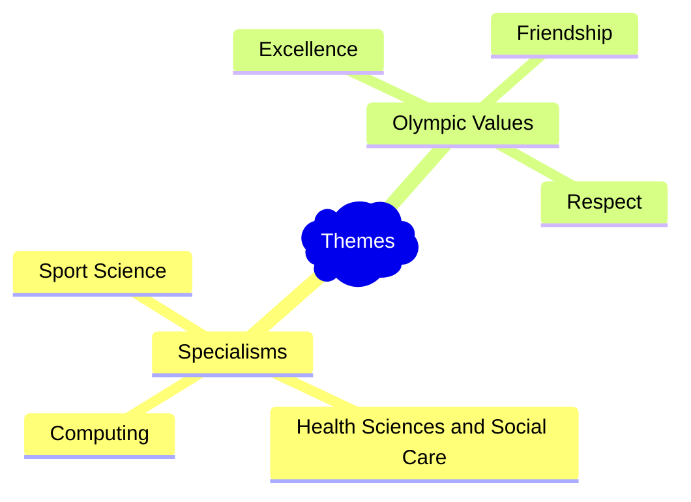

## Start your project

---
## Our Aim
To create web based art on the themes of [UTC Sheffield OLP](https://www.utcsheffield.org.uk/olp/)   

---

### Specialisms
- **Computing**
- **Health Sciences & Social Care**
- **Sport Science**

---

### Olympic Values
- **Excellence** - someone doing the best they can, in sport and in life. It is about taking part and striving for improvement, not just winning.​
- **Friendship** - using sport and to develop tolerance and understanding between all people – performers, spectators and citizens generally.​
- **Respect** - having consideration for oneself, others and the wider environment. It includes respecting the rules of sport and the officials who uphold them.

---
## Your thoughts

